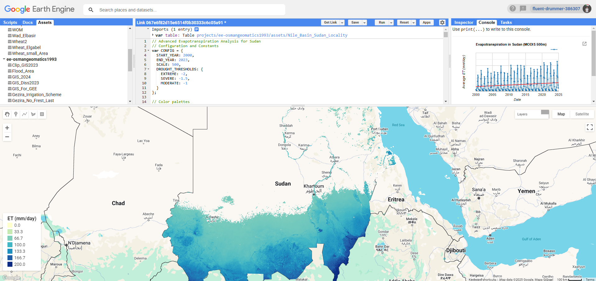
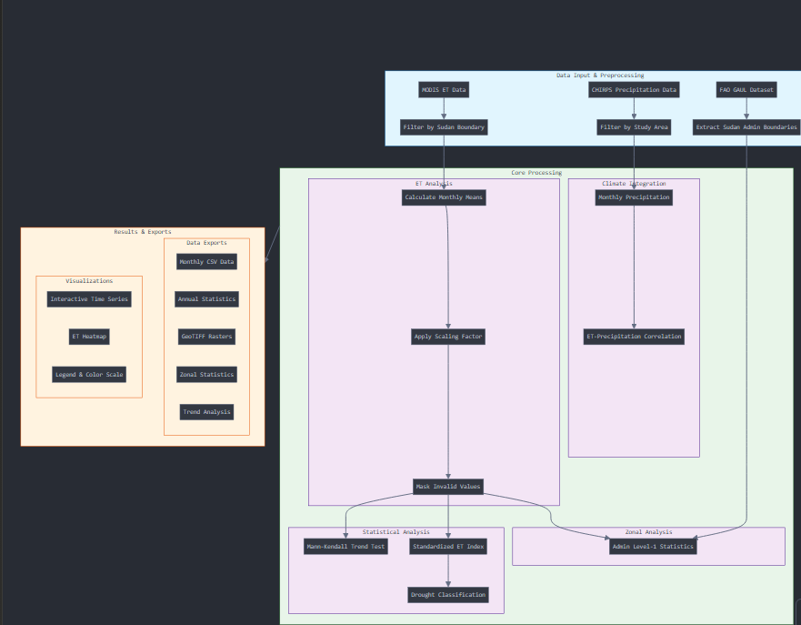
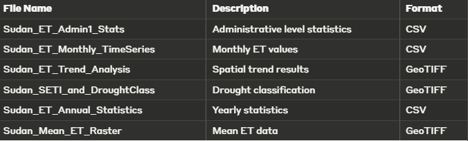
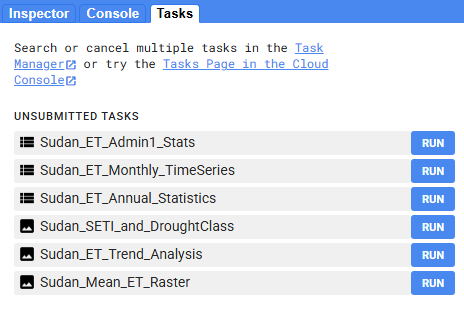
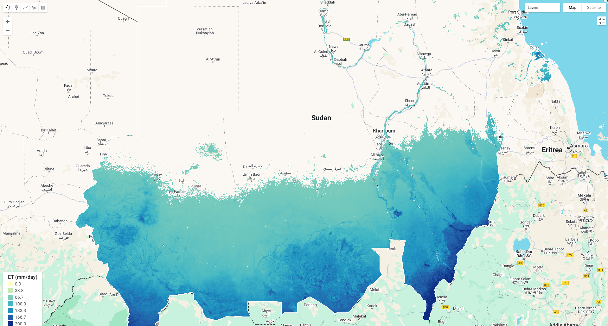
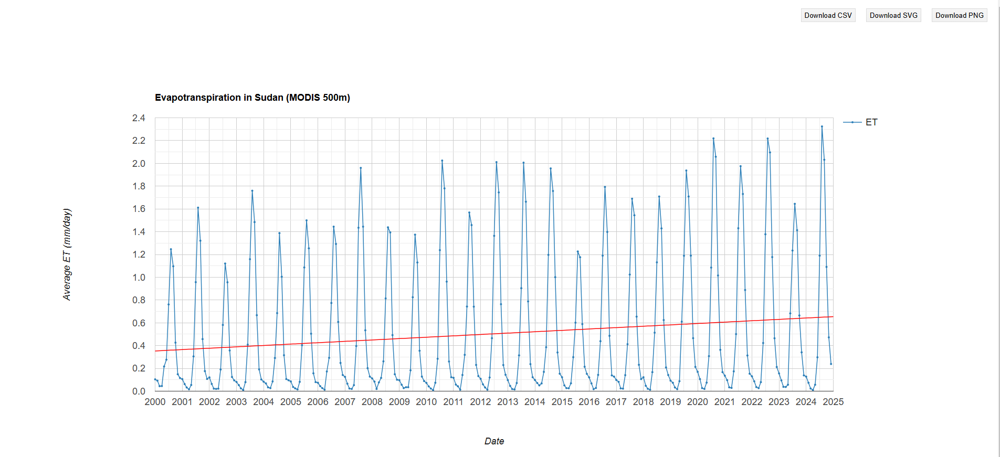

# Sudan-Evapotranspiration-Analysis-Project-
## Overview 
This project provides a comprehensive analysis of evapotranspiration (ET) patterns in Sudan using Google Earth Engine. The analysis includes temporal trends, drought assessment, and climate correlation using MODIS ET data and complementary datasets.

# Features
## 🔍 Core Analysis Components

1. Monthly ET calculations and trend analysis
2. Standardized ET Index (SETI) computation
3. Drought classification and assessment
4. Integration with precipitation data
5. Administrative level zonal statistics
6. Mann-Kendall trend testing

# 📊 Visualization

* Interactive time series charts
* ET heatmaps with custom color scales
* Drought classification maps
* Regional statistics visualization

# 💾 Data Exports

* Monthly time series (CSV)
* Annual statistics (CSV)
* Spatial trend analysis (GeoTIFF)
* SETI and drought classification (GeoTIFF)
* Administrative level statistics (CSV)
* Mean ET raster data (GeoTIFF)

# Prerequisites

1. Google Earth Engine account
2. Google Drive for exports
3. Basic understanding of JavaScript and GEE

# Data Sources

* MODIS ET Data: MOD16A2GF.061
* Administrative Boundaries: FAO GAUL 2015
* Precipitation Data: CHIRPS

# Methodology

# Output Files

# Results

## License
This project is licensed under the MIT License - see the LICENSE.md file for details